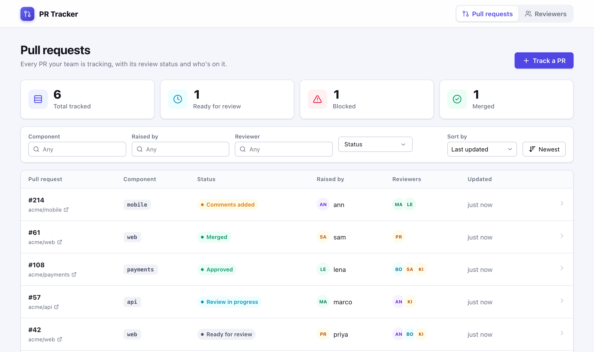
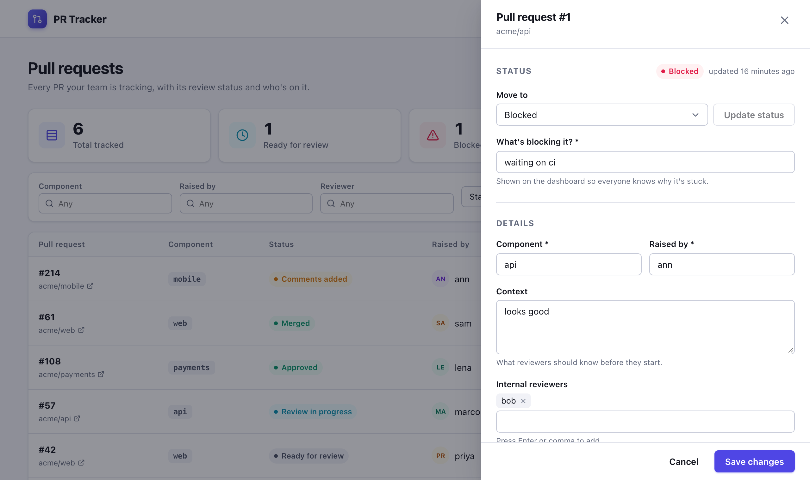

# PR Tracker

**A self-hosted dashboard for tracking pull requests through code review.**

PR Tracker gives a team one place to see every pull request that needs attention: its review
status, who raised it, who is reviewing it, and what is blocking it. It runs on your own
infrastructure, stores its data in PostgreSQL, and exposes everything through a documented REST API.



## Contents

- [Features](#features)
- [How it works](#how-it-works)
- [Quick start](#quick-start)
- [Configuration](#configuration)
- [AI code review](#ai-code-review)
- [Running in production](#running-in-production)
- [Testing](#testing)
- [REST API](#rest-api)
- [Project structure](#project-structure)
- [Contributing](#contributing)
- [License](#license)

## Features

**Review dashboard**

- Track any GitHub pull request by pasting its URL. Links are normalised, so
  `.../pull/7/files?diff=split` and `.../pull/7` are recognised as the same PR and can't be tracked twice.
- Eleven review statuses, from *Ready for review* through *Approved*, *Merged* and *Closed*. A PR
  marked *Blocked* must say why, and the reason is shown on the dashboard.
- Summary cards for total, ready, blocked and merged PRs. Click a card to filter the table to that status.
- Filter by component, author, reviewer and status; sort by any column. Filters live in the URL,
  so a filtered view can be bookmarked or shared.
- Every PR has a shareable link (`/?review=42`) that opens its detail panel directly.
- Separate internal and platform reviewer lists, free-text context for reviewers, and a
  key/value metadata field for things like ticket IDs.

**Reviewer management**

- Keep a directory of reviewers (name, email, GitHub handle).
- Assign each reviewer the components they cover. Component names are created on first use.

**AI code review** *(optional, off by default — see [AI code review](#ai-code-review))*

- Have an LLM (OpenAI or Anthropic — bring your own API key) review a tracked PR's diff and post
  the comments straight to GitHub, on demand or on a schedule.
- Every comment is checked against the actual diff before it's posted or stored: a comment on a
  file or line the model invented is dropped, not trusted.
- Every run — succeeded, failed, or a dry run — is kept, with the model's summary, verdict and
  comment counts, so you can see what the bot did and why.
- **Dry-run by default.** Turning the feature on shows you what it *would* post before it posts
  anything for real.

**Built to be relied on**

- **No lost updates.** Records are versioned; if two people edit the same PR, the second save is
  rejected with a clear message instead of silently overwriting the first. The user's edits are kept.
- **Honest failure states.** A server or network failure is reported as an error with a retry
  button, never as an empty list.
- **Accessible.** Built against WCAG 2.2 AA: full keyboard support, focus-trapped dialogs, a skip
  link, screen-reader announcements for every save and error, and visible focus everywhere.
- **Responsive.** On phones, the table reflows into cards; nothing requires horizontal scrolling.
- **Consistent errors.** The API returns [RFC 9457](https://www.rfc-editor.org/rfc/rfc9457)
  problem responses, with per-field messages for validation failures.



## How it works

```
 Browser ──► React app ──/api──► Spring Boot API ──► PostgreSQL
            (Vite in dev,         (port 8081)        (schema managed
             Express in prod)                          by Flyway)
```

| Layer    | Technology                                                                 |
|----------|----------------------------------------------------------------------------|
| Frontend | React 19, TypeScript, Redux Toolkit (RTK Query), React Router, CSS Modules |
| Serving  | Vite dev server locally; a small Express server in production              |
| Backend  | Java 21, Spring Boot 4, Spring Data JPA, Bean Validation                   |
| Database | PostgreSQL 14+ (16 recommended), migrations by Flyway                      |
| Tests    | JUnit 5 and Testcontainers (backend), Playwright (end-to-end)              |

The browser only ever talks to its own origin. `/api` requests are forwarded to the backend by the
Vite dev server during development and by the Express server in production, so there is no CORS
configuration to manage.

## Quick start

### Prerequisites

- **Java 21** and **Maven 3.9+**
- **Node.js 20.19+ or 22.12+** and npm
- **PostgreSQL 14+**, either installed locally or run with Docker/Podman (see below)

### 1. Get the code

```bash
git clone https://github.com/yashrenhiet/Pr-tracker.git
cd Pr-tracker
cp .env.example .env        # then set POSTGRES_PASSWORD and DB_PASSWORD to the same value
```

### 2. Start PostgreSQL

Pick **one** of these.

**With Docker or Podman** (uses `docker-compose.yml`):

```bash
docker compose up -d postgres      # or: podman-compose up -d postgres
```

**With a local install** (macOS example; on Linux use your package manager):

```bash
brew install postgresql@16 && brew services start postgresql@16
createuser -s prtracker
createdb -O prtracker prtracker
```

A local Homebrew install trusts local connections, so `DB_PASSWORD` can be left empty in `.env`.

### 3. Start the backend

```bash
cd backend
set -a && source ../.env && set +a   # export the DB_* settings
mvn spring-boot:run
```

Flyway creates the schema on first start. Check it's up:

```bash
curl localhost:8081/actuator/health  # {"status":"UP", ...}
```

### 4. Start the frontend

In a second terminal:

```bash
cd frontend
npm install
npm run dev
```

Open **http://localhost:5173**. The dashboard starts empty; click **Track a PR** to add your first one.

## Configuration

All settings are environment variables. `.env.example` lists them with working defaults.

| Variable            | Used by    | Default                                     | Purpose                            |
|---------------------|------------|---------------------------------------------|------------------------------------|
| `DB_URL`            | backend    | `jdbc:postgresql://localhost:5432/prtracker` | JDBC connection string             |
| `DB_USERNAME`       | backend    | `prtracker`                                 | Database user                      |
| `DB_PASSWORD`       | backend    | *(empty)*                                   | Database password                  |
| `SERVER_PORT`       | backend    | `8081`                                      | API port                           |
| `BACKEND_URL`       | frontend   | `http://localhost:8081`                     | Where `/api` requests are forwarded |
| `PORT`              | frontend   | `3000`                                      | Port for the production server     |
| `POSTGRES_DB`       | compose    | `prtracker`                                 | Database created by the container  |
| `POSTGRES_USER`     | compose    | `prtracker`                                 | User created by the container      |
| `POSTGRES_PASSWORD` | compose    | *(required)*                                | Password for that user             |
| `POSTGRES_PORT`     | compose    | `5432`                                      | Host port for the container        |

See [AI code review](#ai-code-review) for the `AI_REVIEW_*` variables — all optional, and the
feature is fully disabled unless you set them.

## AI code review

An optional engine that reviews a tracked PR's diff with an LLM and posts the review straight to
GitHub. Disabled by default; tracking a PR never calls out to a model or GitHub unless you turn
this on.

**Pipeline**, run per PR, isolated from every other PR's runs:

```
fetch diff (GitHub) ──► prompt the model ──► validate its reply ──► post to GitHub ──► record the run
```

1. The diff is fetched from GitHub (or GitHub Enterprise) using `AI_REVIEW_GITHUB_TOKEN`.
2. The configured model is asked to return a summary, a verdict, and a list of inline comments as JSON.
3. **Every comment is validated against the diff it was shown** before anything is trusted: a
   comment on a file or line that isn't actually part of the diff is dropped (and logged), not
   posted. An unrecognised severity or verdict is normalised rather than rejecting the whole review.
4. Unless `AI_REVIEW_DRY_RUN=true` (the default), the surviving comments are posted to GitHub as a
   single review, and the tracked PR's status is updated: `BOT_REVIEW_COMPLETED` if it left
   comments, `READY_FOR_PLATFORM_REVIEW` if it approved with none, or `BOT_REVIEW_REJECTED` if the
   pipeline failed. This only happens to PRs still waiting on a review — a bot run finishing after
   a human already merged, closed or approved a PR never touches its status.
5. Every attempt — success, failure, or dry run — is kept as its own row (`ai_review_run`), so
   there's a full history of what the bot did, not just its latest verdict.

**Setup:**

```bash
AI_REVIEW_ENABLED=true
AI_REVIEW_PROVIDER=openai            # or: anthropic
AI_REVIEW_API_KEY=sk-...             # your OpenAI or Anthropic key
AI_REVIEW_GITHUB_TOKEN=ghp_...       # needs to read PRs, and (once out of dry-run) post reviews
```

| Variable                     | Default                | Purpose                                                          |
|-------------------------------|-------------------------|-------------------------------------------------------------------|
| `AI_REVIEW_ENABLED`           | `false`                 | Master switch. Everything else is inert while this is `false`.    |
| `AI_REVIEW_PROVIDER`          | `openai`                | `openai` or `anthropic`                                           |
| `AI_REVIEW_API_KEY`           | *(none)*                | API key for the chosen provider                                   |
| `AI_REVIEW_MODEL`             | *(provider default)*    | e.g. `gpt-4o-mini`, `claude-sonnet-4-5-20250929`                  |
| `AI_REVIEW_BASE_URL`          | *(provider's public API)* | Point at a proxy or self-hosted OpenAI-/Anthropic-compatible gateway |
| `AI_REVIEW_GITHUB_TOKEN`      | *(none)*                | PAT with PR read (and, out of dry-run, write) access               |
| `AI_REVIEW_DRY_RUN`           | `true`                  | `true`: generate the review but don't post it or move the PR's status |
| `AI_REVIEW_TIMEOUT_SECONDS`   | `120`                   | Read timeout for the model call                                   |
| `AI_REVIEW_MAX_DIFF_CHARS`    | `60000`                 | Diffs larger than this are truncated at the last complete file    |
| `AI_REVIEW_SCHEDULER_ENABLED` | `false`                 | Automatically review PRs in `READY_FOR_REVIEW` or `COMMENTS_ADDRESSED` |
| `AI_REVIEW_SCHEDULER_CRON`    | `0 */10 * * * *`        | How often the scheduler checks for PRs due a review               |
| `AI_REVIEW_SCHEDULER_BATCH_SIZE` | `5`                  | Max PRs reviewed per scheduler tick                                |

**Trying it safely:** set `AI_REVIEW_ENABLED=true` and leave `AI_REVIEW_DRY_RUN` at its default
(`true`). Trigger a review from a PR's detail panel (or `POST /api/reviews/{id}/ai-review`) and
you'll get the model's summary, verdict and comments back without anything being posted to GitHub
or the PR's status changing. Set `AI_REVIEW_DRY_RUN=false` once you're happy with what it produces.

**Known limitation:** an oversized diff is truncated at the last file boundary that fits
(`AI_REVIEW_MAX_DIFF_CHARS`), not split into multiple model calls — files past the cutoff simply
aren't reviewed. This is a deliberate scope decision, not an oversight: chunking a diff across
calls while keeping one coherent final review is real complexity that most PRs never need. Raise
`AI_REVIEW_MAX_DIFF_CHARS` if you routinely review very large PRs.

## Running in production

Build and run the backend as a single jar:

```bash
cd backend
mvn clean package
DB_URL=... DB_USERNAME=... DB_PASSWORD=... java -jar target/prtracker-backend-0.1.0-SNAPSHOT.jar
```

Build the frontend and serve it with the bundled Express server, which serves the static app,
forwards `/api` to the backend, and falls back to `index.html` for client-side routes:

```bash
cd frontend
npm ci
npm run build          # app    -> frontend/dist
npm run server:build   # server -> frontend/dist-server
BACKEND_URL=http://your-backend:8081 PORT=3000 npm run server:start
```

The Express server exposes `GET /health` for load-balancer checks; the backend exposes
`GET /actuator/health`.

PR Tracker has no built-in authentication. Deploy it behind your organisation's SSO or an
authenticating reverse proxy.

## Testing

### Backend

```bash
cd backend
mvn test
```

Unit tests always run. The API and schema tests need a PostgreSQL database, found in this order:

1. **`TEST_DB_URL`** (with optional `TEST_DB_USERNAME`, default `prtracker`, and `TEST_DB_PASSWORD`).
   The tests **drop and recreate that database's `public` schema** before running, so point it at a
   throwaway database:

   ```bash
   createdb -O prtracker prtracker_test
   TEST_DB_URL=jdbc:postgresql://localhost:5432/prtracker_test mvn test
   ```

2. **Testcontainers**, if Docker or Podman is running. A disposable PostgreSQL container is
   started automatically.

3. **Neither available:** the database tests are *skipped*, not passed. Check the Maven summary
   for the skipped count.

<details>
<summary>Using Testcontainers with Podman on macOS</summary>

```bash
brew install podman podman-compose
podman machine init && podman machine start

export DOCKER_HOST="unix://$(podman machine inspect --format '{{.ConnectionInfo.PodmanSocket.Path}}')"
export TESTCONTAINERS_DOCKER_SOCKET_OVERRIDE=/var/run/docker.sock
export TESTCONTAINERS_RYUK_DISABLED=true
```

Ryuk, Testcontainers' cleanup container, is unreliable on Podman. With it disabled, containers left
behind by a killed test run can be removed with `podman container prune`.

</details>

### Frontend

```bash
cd frontend
npm run lint           # oxlint
npm run build          # type-checks, then builds
```

### End-to-end

The Playwright suite drives a real browser against the running app. It covers failure states
(server errors, offline, unknown routes), keyboard and focus behaviour in dialogs, concurrent-edit
handling, and the mobile layout.

```bash
# with the backend and `npm run dev` both running:
cd frontend
npm run test:e2e
```

The suite uses the Google Chrome already installed on your machine (`channel: "chrome"` in
`playwright.config.ts`), so `npx playwright install` isn't needed. Some tests change data, so
run them against a development database, not production.

## REST API

Base path: `/api`. Request and response bodies are JSON. Timestamps are UTC ISO-8601
(`2026-09-25T13:43:18.809Z`).

### Reviews

| Method   | Path                   | Description                                                   |
|----------|------------------------|---------------------------------------------------------------|
| `GET`    | `/reviews`             | List reviews, with filters and paging (see below)             |
| `POST`   | `/reviews`             | Track a PR. Requires `prUrl`, `component`, `raisedBy`         |
| `GET`    | `/reviews/{id}`        | Get one review                                                |
| `PATCH`  | `/reviews/{id}`        | Update fields; omitted fields are left unchanged              |
| `PUT`    | `/reviews/{id}/status` | Change status: `{"status": "BLOCKED", "blockReason": "..."}`  |
| `DELETE` | `/reviews/{id}`        | Stop tracking a PR                                            |

Query parameters for `GET /reviews` (all optional):

| Parameter                  | Description                                                              |
|----------------------------|--------------------------------------------------------------------------|
| `status`                   | One or more statuses, comma-separated                                    |
| `component`                | Component name                                                           |
| `raisedBy`                 | Author                                                                   |
| `reviewer`                 | Matches either internal or platform reviewers                            |
| `createdFrom`, `createdTo` | ISO-8601 with offset; `createdTo` is exclusive                           |
| `page`, `size`             | Zero-based page, and page size from 1 to 100 (default 20)                |
| `sort`, `direction`        | `createdAt`, `updatedAt` (default), `status`, `raisedBy`, `component`; `ASC` or `DESC` (default) |

Example:

```bash
curl -X POST localhost:8081/api/reviews \
  -H 'Content-Type: application/json' \
  -d '{"prUrl": "https://github.com/acme/api/pull/57", "component": "api", "raisedBy": "marco",
       "internalReviewers": ["ann"], "metadata": {"ticket": "API-311"}}'

curl 'localhost:8081/api/reviews?status=READY_FOR_REVIEW,BLOCKED&component=api&sort=createdAt'
```

**Statuses:** `READY_FOR_REVIEW`, `REVIEW_IN_PROGRESS`, `COMMENTS_ADDED`, `COMMENTS_ADDRESSED`,
`APPROVED`, `MERGED`, `BLOCKED`, `BOT_REVIEW_COMPLETED`, `READY_FOR_PLATFORM_REVIEW`,
`BOT_REVIEW_REJECTED`, `CLOSED`.

**Rules the API enforces:**

- A PR URL can be tracked only once; a duplicate returns `409 Conflict`.
- `BLOCKED` requires a `blockReason`. Moving to any other status clears it.
- `PATCH` accepts the record's `version`. If someone else has saved since you read it, you get
  `409 Conflict` rather than overwriting their change.
- Reviewer names are trimmed and de-duplicated, ignoring case.

### Reviewers and components

| Method   | Path                                     | Description                               |
|----------|------------------------------------------|-------------------------------------------|
| `GET`    | `/reviewers`                             | List reviewers, sorted by name            |
| `POST`   | `/reviewers`                             | Add a reviewer: `name`, `email`, `handle` |
| `DELETE` | `/reviewers/{id}`                        | Remove a reviewer and their assignments   |
| `PUT`    | `/reviewers/{id}/components/{component}` | Assign a component (idempotent)           |
| `DELETE` | `/reviewers/{id}/components/{component}` | Unassign a component (idempotent)         |
| `GET`    | `/components`                            | List all known component names            |

Emails, handles and component assignments are unique, ignoring case.

### AI review

See [AI code review](#ai-code-review) for how the pipeline behaves. All endpoints return
`503 Service Unavailable` if `AI_REVIEW_ENABLED` is not `true`, or the configured provider/GitHub
token is missing.

| Method | Path                              | Description                                                        |
|--------|------------------------------------|---------------------------------------------------------------------|
| `GET`  | `/ai-review/config`                | Whether the feature is enabled, and the active provider/model — no secrets |
| `POST` | `/reviews/{id}/ai-review`          | Run the pipeline now and return its outcome. `409` if already running for this PR |
| `GET`  | `/reviews/{id}/ai-review`          | The most recent run for this PR. `404` if it has never been reviewed |
| `GET`  | `/reviews/{id}/ai-review/history`  | Every run for this PR, newest first                                |

```bash
curl -X POST localhost:8081/api/reviews/57/ai-review

# {"id":3,"reviewId":57,"status":"SUCCEEDED","verdict":"REQUEST_CHANGES",
#  "summary":"...","commentsPosted":2,"commentsRejected":0,"provider":"openai",
#  "model":"gpt-4o-mini","dryRun":true,"error":null,"startedAt":"...","completedAt":"..."}
```

### Errors

Every error is an RFC 9457 problem document. Validation errors also list each field:

```json
{
  "status": 400,
  "title": "Bad Request",
  "detail": "Validation failed",
  "instance": "/api/reviewers",
  "errors": [{ "field": "email", "message": "must be a well-formed email address" }]
}
```

## Project structure

```
.
├── backend/                         Spring Boot API
│   └── src/main/
│       ├── java/io/prtracker/
│       │   ├── review/              PRs: entity, filtering, status rules, URL normalisation
│       │   ├── reviewer/            Reviewers and their component assignments
│       │   ├── component/           Component listing
│       │   ├── aireview/            AI review pipeline, GitHub client, LLM providers, scheduler
│       │   └── common/              Error handling (RFC 9457), paging, input normalisation
│       └── resources/db/migration/  Flyway SQL migrations
├── frontend/
│   ├── src/
│   │   ├── pages/                   Dashboard, Reviewers, Not found
│   │   ├── components/ui/           In-house component library (CSS Modules, no UI dependency)
│   │   ├── store/api.ts             RTK Query API client: all server state and caching
│   │   ├── hooks/                   Debouncing, modal focus management, page titles
│   │   └── styles/tokens.css        Design tokens: colour, spacing, radius, shadow
│   ├── server/                      Express production server
│   └── e2e/                         Playwright tests
├── docs/                            Screenshots
├── docker-compose.yml               PostgreSQL for local development
└── .env.example                     Configuration template
```

### Data model

| Table                | Purpose                                                                |
|----------------------|--------------------------------------------------------------------------|
| `pr_review`          | One row per tracked PR: status, reviewers, context, metadata, version  |
| `reviewer`           | Reviewer directory                                                     |
| `reviewer_component` | Which components each reviewer covers                                  |
| `ai_review_run`      | One row per AI review attempt: verdict, summary, comment counts, errors |

Statuses are stored as readable text guarded by a `CHECK` constraint, reviewer lists as
PostgreSQL arrays, and free-form metadata as `jsonb`.

## Contributing

Contributions are welcome. Bug reports, fixes and improvements all help.

1. **Open an issue first** for anything beyond a small fix, so the approach can be agreed before
   you spend time on it.
2. **Fork and branch** from `main`.
3. **Keep changes focused.** One concern per pull request is much easier to review.
4. **Run the checks** before opening your PR:

   ```bash
   (cd backend && mvn test)
   (cd frontend && npm run lint && npm run build)
   ```

   If you change the UI, run `npm run test:e2e` too.
5. **Change the schema through a new migration** (`V2__...sql`, and so on). Never edit a
   migration that has already been released.
6. **Describe the why** in your PR: what problem it solves, and how you tested it.

Conventions: UI colours and spacing come from `tokens.css`, not hard-coded values; new UI must
work with a keyboard alone and meet WCAG 2.2 AA; API errors go through `GlobalExceptionHandler`
so they stay RFC 9457-shaped.

## License

Released under the [MIT License](LICENSE).
